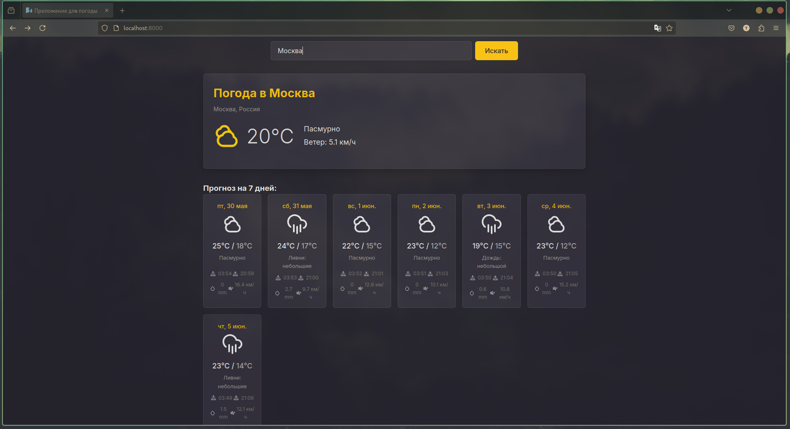

# Стильное погодное веб-приложение 🌬️✨

**Узнайте погоду стильно!** Это веб-приложение предоставляет прогноз погоды для любого города, используя данные от Open-Meteo API. Проект выполнен в качестве задания с акцентом на качество кода, удобство использования и современные практики разработки.

## Содержание

- [Функционал](#функционал)
  - [Основные возможности](#основные-возможности)
  - [Дополнительные улучшения ("плюшки")](#дополнительные-улучшения-плюшки)
- [Скриншоты](#скриншоты)
- [Технологический стек](#технологический-стек)
- [Установка и запуск](#установка-и-запуск)
  - [Предварительные требования](#предварительные-требования)
  - [1. Локальный запуск (без Docker, для разработки)](#1-локальный-запуск-без-docker-для-разработки)
  - [2. Запуск с помощью Docker (рекомендуемый способ)](#2-запуск-с-помощью-docker-рекомендуемый-способ)
    - [Установка Docker](#установка-docker)
    - [Возможные проблемы с Docker и их решения](#возможные-проблемы-с-docker-и-их-решения)
- [Тестирование](#тестирование)
- [Структура проекта](#структура-проекта)
- [API Эндпоинты](#api-эндпоинты)
- [Автор](#автор)

---

## Функционал

### Основные возможности (согласно ТЗ):

-   [x] **Ввод названия города:** Пользователь может ввести название любого города в мире.
-   [x] **Прогноз погоды:** Приложение отображает прогноз погоды на ближайшие 7 дней для указанного города.
-   [x] **Удобно читаемый формат:** Данные о погоде представлены в структурированном и интуитивно понятном виде, включая:
    -   Текущую температуру, описание погоды (например, "Ясно", "Пасмурно"), скорость ветра.
    -   Прогноз на каждый из 7 дней: максимальная/минимальная температура, иконка и описание погоды, время восхода/заката, сумма осадков, максимальная скорость ветра.
-   [x] **Использование API Open-Meteo:** Все погодные данные получаются через публичное API [Open-Meteo](https://open-meteo.com/).

### Дополнительные улучшения ("плюшки"):

-   [x] **Написаны тесты:** Проект покрыт unit-тестами с использованием `pytest`. Текущее покрытие кода составляет **89%**.
-   [x] **Упаковано в Docker контейнер:** Приложение можно легко собрать и запустить с помощью Docker и Docker Compose, обеспечивая консистентность окружения.
-   [x] **Автодополнение (подсказки) при вводе города:** При вводе названия города появляются подсказки с подходящими вариантами (город, регион, страна), что улучшает UX и точность ввода.
    -   [x] Реализована навигация по списку подсказок с помощью клавиатуры (стрелки Вверх/Вниз).
    -   [x] Выбор подсказки по нажатию Enter.
    -   [x] Закрытие списка подсказок по нажатию Esc.
    -   [x] Скрытие списка при отправке формы по Enter из поля ввода.
-   [x] **Предложение последнего города:** При повторном посещении сайта пользователю предлагается посмотреть погоду в городе, который он искал ранее (информация хранится в `localStorage`).
-   [x] **История поиска и статистика:**
    -   [x] Для каждого пользователя (идентифицированного по `user_id` в `httpOnly` cookie) сохраняется история его поисковых запросов (город, регион, страна, координаты, время).
    -   [x] Реализован API эндпоинт (`/api/stats/city-searches`), показывающий, сколько раз пользователи искали каждый город.
    -   [x] Реализован API эндпоинт (`/api/history/user`), показывающий историю поиска для текущего пользователя (с возможностью ограничения количества записей).
-   [x] **Современный и адаптивный дизайн:** Приложение имеет стильный пользовательский интерфейс (темная тема с янтарными акцентами), который адаптируется под разные размеры экранов.
-   [x] **Продуманная архитектура:** Код структурирован по модулям (API, сервисы, CRUD, модели, схемы), что облегчает понимание и поддержку.

---

## Скриншоты

**Главный экран:**


**Отображение погоды:**


---

## Технологический стек

*   **Backend:**
    *   **Python 3.10+**
    *   **FastAPI:** Современный, быстрый (высокопроизводительный) веб-фреймворк для создания API.
    *   **Uvicorn:** ASGI-сервер для запуска FastAPI.
    *   **HTTPX:** Асинхронный HTTP-клиент для взаимодействия с внешним API Open-Meteo.
    *   **SQLAlchemy:** ORM для работы с базой данных.
    *   **Pydantic (V2):** Валидация данных и управление настройками.
*   **Frontend:**
    *   **HTML5**
    *   **CSS3** (без использования CSS-фреймворков, чистый CSS)
    *   **Vanilla JavaScript (ES6+):** Для интерактивности, AJAX-запросов, DOM-манипуляций.
*   **База данных:**
    *   **SQLite:** Легковесная, файловая СУБД для хранения истории поиска.
*   **Тестирование:**
    *   **Pytest:** Популярный фреймворк для тестирования Python-кода.
    *   **pytest-asyncio:** Для поддержки асинхронных тестов.
    *   **pytest-cov:** Для генерации отчетов о покрытии кода тестами.
    *   **respx:** Для мокинга HTTP-запросов к внешним API в тестах.
*   **Контейнеризация:**
    *   **Docker**
    *   **Docker Compose** (для удобства управления)
*   **Инструменты:**
    *   **Git:** Система контроля версий.
    *   **GitHub:** Платформа для хостинга репозитория.

---

## Установка и запуск

### Предварительные требования:

*   **Для локального запуска:**
    *   Python 3.10 или выше.
    *   `pip` (менеджер пакетов Python).
    *   (Рекомендуется) Виртуальное окружение (`venv`).
*   **Для запуска через Docker:**
    *   Установленный и запущенный Docker Engine и Docker Compose.

### 1. Локальный запуск (без Docker, для разработки)

1.  **Клонируйте репозиторий:**
    ```bash
    git clone https://github.com/ToMaTiKkk/stylish_weather_web_app.git
    cd stylish_weather_web_app
    ```

2.  **Создайте и активируйте виртуальное окружение** (рекомендуется):
    ```bash
    python -m venv venv
    # Для Linux/macOS:
    source venv/bin/activate
    # Для Windows (PowerShell):
    # .\venv\Scripts\Activate.ps1
    # Для Windows (cmd.exe):
    # venv\Scripts\activate.bat
    ```

3.  **Установите зависимости:**
    ```bash
    pip install -r requirements.txt
    ```

4.  **(Только при первом запуске или если меняли модели БД) Установите проект в режиме редактирования для корректной работы pytest с путями:**
    ```bash
    pip install -e .
    ```

5.  **Запустите приложение** с помощью Uvicorn:
    (Находясь в корневой папке проекта `stylish_weather_web_app`)
    ```bash
    uvicorn app.main:app --reload --host 0.0.0.0 --port 8000
    ```
    Файл базы данных `stylish_weather_app.db` будет создан в корневой папке проекта при первом запуске.

6.  **Откройте приложение в браузере:**
    Перейдите по адресу `http://localhost:8000`

### 2. Запуск с помощью Docker (рекомендуемый способ)

#### Установка Docker:

Если у вас еще не установлен Docker и Docker Compose:

*   **Windows / macOS:**
    *   Скачайте и установите [Docker Desktop](https://www.docker.com/products/docker-desktop/). Docker Compose обычно включен в Docker Desktop.

*   **Linux (Общие шаги):**
    *   Следуйте официальной инструкции по установке Docker Engine для вашего дистрибутива на [официальном сайте Docker](https://docs.docker.com/engine/install/).
    *   После установки Docker Engine, установите плагин Docker Compose (рекомендуемый способ для новых версий) или отдельный пакет Docker Compose.

*   **Linux (Arch Linux / Manjaro):**
    1.  **Установите пакеты `docker` и `docker-compose`:**
        ```bash
        sudo pacman -S docker docker-compose
        ```
    2.  **Включите службу Docker для автозапуска при загрузке системы:**
        ```bash
        sudo systemctl enable docker
        ```
        Или (часто `docker.socket` предпочтительнее для активации по требованию):
        ```bash
        sudo systemctl enable docker.socket
        ```
    3.  **Запустите службу Docker немедленно (если она еще не запущена):**
        ```bash
        sudo systemctl start docker
        ```
        Или (если использовали `docker.socket`):
        ```bash
        sudo systemctl start docker.socket
        ```
    4.  **(Важно для Arch Linux и других дистрибутивов) Добавьте вашего пользователя в группу `docker`, чтобы избежать использования `sudo` для каждой Docker-команды:**
        ```bash
        sudo usermod -aG docker $USER
        ```
        После выполнения этой команды **необходимо выйти из системы и войти снова** (или перезагрузить компьютер), чтобы изменения членства в группе вступили в силу. Для текущей сессии терминала может помочь команда `newgrp docker` (откроет новую оболочку с правильными правами группы).

#### Запуск приложения:

1.  **Клонируйте репозиторий** (если еще не сделали):
    ```bash
    git clone https://github.com/ToMaTiKkk/stylish_weather_web_app.git
    cd stylish_weather_web_app
    ```

2.  **Соберите образ и запустите контейнер** с помощью Docker Compose:
    (Находясь в корневой папке проекта, где лежит файл `docker-compose.yml`)
    ```bash
    docker-compose up --build
    ```
    Чтобы запустить контейнер в фоновом режиме:
    ```bash
    docker-compose up --build -d
    ```

3.  **Откройте приложение в браузере:**
    Перейдите по адресу `http://localhost:8000`

4.  **Просмотр логов контейнера** (если запущен в detached режиме):
    ```bash
    docker-compose logs -f stylish-weather-app
    ```

5.  **Остановка приложения:**
    Нажмите `Ctrl+C` в терминале, где запущен `docker-compose up`.
    Если запускали с `-d`, используйте команду:
    ```bash
    docker-compose down
    ```
    Файл базы данных `stylish_weather_app.db` останется в корне вашего проекта благодаря монтированию тома.

#### Возможные проблемы с Docker и их решения:

*   **Ошибка `permission denied while trying to connect to the Docker daemon socket` (Linux):**
    *   **Решение:** Добавьте вашего пользователя в группу `docker` (`sudo usermod -aG docker $USER`) и **перезайдите в систему** или выполните `newgrp docker` в текущем терминале.
*   **Порт 8000 уже занят:**
    *   **Решение:** Остановите другое приложение или измените порт в `docker-compose.yml` (например, `"8001:8000"`).

---

## Тестирование

Проект содержит набор unit-тестов с использованием `pytest`.

**Для запуска тестов:**
1.  Убедитесь, что вы в активированном виртуальном окружении с установленными зависимостями.
2.  Выполните в корневой папке проекта:
    ```bash
    pytest
    ```

**Для запуска тестов с отчетом о покрытии кода:**
```bash
pytest --cov=app --cov-report=html
```

Отчет будет доступен в файле htmlcov/index.html.
Текущее покрытие кода: 89%.

---

## Структура проекта
```
stylish_weather_web_app/
├── app/ # Основной код приложения
│ ├── crud/ # CRUD-операции (Create, Read, Update, Delete)
│ │ └── history_crud.py
│ ├── db/ # Настройки базы данных и SQLAlchemy
│ │ └── session.py
│ ├── models/ # SQLAlchemy модели (описание таблиц БД)
│ │ └── history_model.py
│ ├── schemas/ # Pydantic модели (схемы для валидации и сериализации)
│ │ └── history_schema.py
│ ├── services/ # Бизнес-логика, взаимодействие с внешними API
│ │ └── open_meteo_service.py
│ ├── static/ # Статические файлы (CSS, JavaScript, иконки)
│ │ ├── css/
│ │ ├── icons/
│ │ └── js/
│ ├── templates/ # HTML шаблоны (Jinja2)
│ │ └── index.html
│ └── main.py # Главный файл FastAPI приложения, определение эндпоинтов
├── tests/ # Тесты
│ ├── conftest.py # Общие фикстуры pytest
│ ├── test_api.py # Тесты для API эндпоинтов
│ ├── test_crud.py # Тесты для CRUD операций
│ └── test_services.py # Тесты для сервисного слоя
├── .dockerignore # Файлы, игнорируемые при сборке Docker-образа
├── .gitignore # Файлы, игнорируемые Git
├── Dockerfile # Инструкции для сборки Docker-образа
├── docker-compose.yml # Конфигурация для запуска приложения с Docker Compose
├── pyproject.toml # Конфигурация проекта (для pytest, setuptools)
├── README.md # Этот файл
├── requirements.txt # Список зависимостей Python
└── stylish_weather_app.db # Файл базы данных SQLite (создается при запуске)
```

---

## API Эндпоинты

Ниже перечислены основные API эндпоинты, предоставляемые приложением:

*   **`GET /`**
    *   **Описание:** Возвращает главную HTML страницу приложения.
    *   **Параметры:** Нет.
    *   **Ответ:** HTML страница.

*   **`GET /api/weather/{city_name}`**
    *   **Описание:** Получает прогноз погоды для указанного города.
    *   **Path параметры:**
        *   `city_name` (str): Название города.
    *   **Query параметры (опциональные, используются при выборе из автодополнения для уточнения):**
        *   `lat` (float): Широта.
        *   `lon` (float): Долгота.
        *   `selected_name` (str): Точное имя города из подсказки.
        *   `selected_admin1` (str): Регион/область из подсказки.
        *   `selected_country` (str): Страна из подсказки.
    *   **Пример запроса (по имени):** `/api/weather/Лондон`
    *   **Пример запроса (с координатами):** `/api/weather/Москва?lat=43.61&lon=-116.20&selected_name=Москва&selected_admin1=Айдахо&selected_country=Соединенные%20Штаты`
    *   **Ответ:** JSON с информацией о городе и прогнозом погоды.

*   **`GET /api/autocomplete/cities`**
    *   **Описание:** Возвращает список городов для автодополнения на основе строки поиска.
    *   **Query параметры:**
        *   `query` (str): Часть имени города (минимум 2 символа).
    *   **Пример запроса:** `/api/autocomplete/cities?query=Берл`
    *   **Ответ:** JSON-массив объектов городов, каждый из которых содержит `name`, `admin1`, `country`, `latitude`, `longitude`.

*   **`GET /api/stats/city-searches`**
    *   **Описание:** Возвращает статистику по частоте поиска для каждого города.
    *   **Параметры:** Нет.
    *   **Ответ:** JSON-массив объектов, каждый из которых содержит `city_name` и `search_count`.

*   **`GET /api/history/user`**
    *   **Описание:** Возвращает историю поиска для текущего пользователя (определенного по `user_id` из cookie).
    *   **Query параметры (опциональные):**
        *   `limit` (int): Максимальное количество записей для возврата. По умолчанию 10, максимальное значение 50, минимальное 1.
    *   **Пример запроса:** `/api/history/user?limit=5`
    *   **Ответ:** JSON-массив объектов истории поиска, каждый из которых содержит `city_name`, `search_timestamp`, `admin1`, `country`, `latitude`, `longitude`.

---
*Разработано ToMaTiK* 😉
